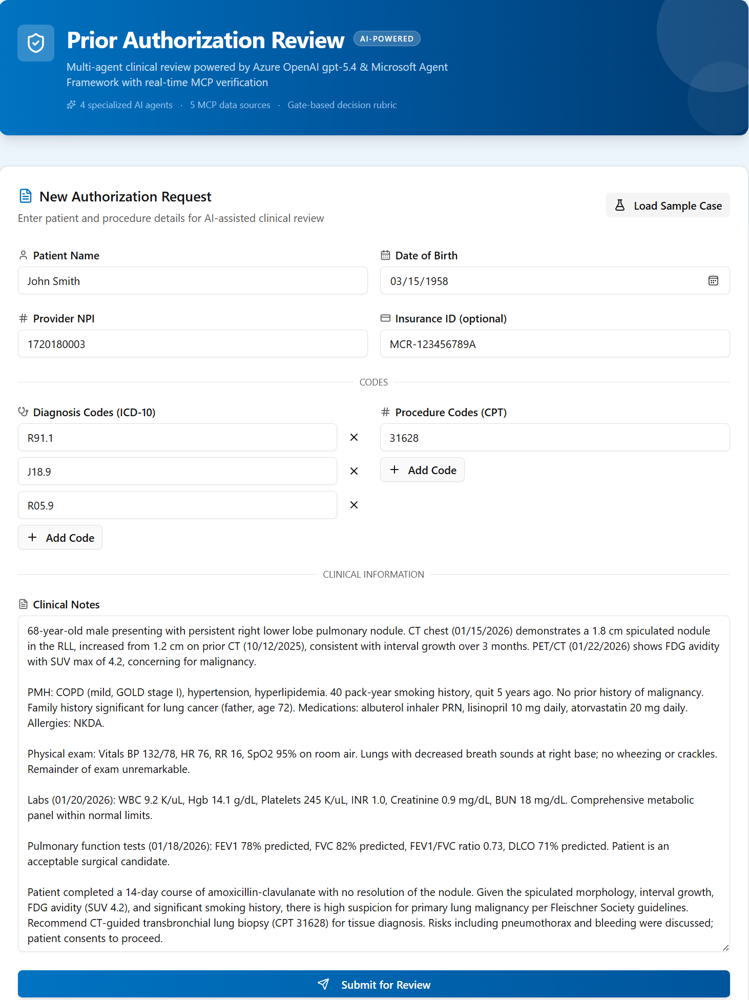

# Architecture

## Multi-Agent Architecture

The application uses a **pure HTTP dispatch** architecture. The FastAPI backend has no local AI runtime — all specialist reasoning runs in four independent Foundry Hosted Agent containers.

- **Frontend + FastAPI backend/orchestrator run in Azure Container Apps**
- **Each of the 4 specialist agents is a standalone Foundry Hosted Agent** (independent container, independently scalable)
- **The backend owns**: SSE progress streaming, review persistence, decision handling, audit PDF generation, and HTTP dispatch to the agent containers

```
┌────────────────────────────────────────────────────────────────────┐
│ Next.js Frontend (ACA)                                            │
│ UploadForm → POST /api/review/stream → ProgressTracker            │
│ ReviewDashboard → DecisionPanel → PDF downloads                   │
└──────────────────────────────┬─────────────────────────────────────┘
                               │ REST + SSE
┌──────────────────────────────▼─────────────────────────────────────┐
│ FastAPI Backend + Orchestrator (ACA)                              │
│ - Pre-flight validation                                           │
│ - Phase orchestration and retries                                 │
│ - SSE progress events                                             │
│ - Review store + decision handling                                │
│ - Audit/PDF generation                                            │
└───────────────┬───────────────────────────────┬────────────────────┘
                │                               │
  POST */responses               │ OpenTelemetry
  (Foundry Responses API)        │
┌───────────────▼───────────────────────────────────────────────┐
│ Microsoft Foundry Agent Service                               │
│ - Compliance Agent                                            │
│ - Clinical Agent                                              │
│ - Coverage Agent                                              │
│ - Synthesis Agent                                             │
│ - Native evaluation / lifecycle / control-plane visibility    │
└───────────────┬───────────────────────────────────────────────┘
                │ MCP tools / model runtime
┌───────────────▼───────────────────────────────────────────────┐
│ MCP servers + Azure OpenAI gpt-5.4 endpoint                  │
│ NPI Registry • ICD-10 • CMS Coverage • Clinical Trials • PubMed │
└───────────────────────────────────────────────────────────────┘
```

## Project Structure

```
prior-auth-maf/
├── backend/               # FastAPI orchestrator — SSE streaming, review dashboard, audit PDF
│   ├── app/
│   │   ├── agents/        # HTTP dispatchers to hosted agent containers + orchestrator
│   │   ├── routers/       # /review, /decision, /agents endpoints
│   │   ├── services/      # hosted_agents.py HTTP dispatch, audit_pdf.py, cpt_validation.py, notification.py
│   │   └── models/        # Pydantic schemas (schemas.py)
│   └── Dockerfile
│
├── agents/                # Four independent MAF Hosted Agent deployable units
│   ├── clinical/          # ICD-10, PubMed, Clinical Trials MCP — port 8001
│   │   ├── main.py        # ResponsesHostServer entry point + structured output via default_options
│   │   ├── schemas.py     # Pydantic output model (ClinicalResult)
│   │   ├── Dockerfile
│   │   ├── agent.yaml     # Foundry Hosted Agent descriptor
│   │   └── skills/clinical-review/SKILL.md
│   ├── coverage/          # NPI Registry, CMS Coverage MCP — port 8002
│   │   ├── main.py
│   │   ├── schemas.py     # Pydantic output model (CoverageResult)
│   │   ├── Dockerfile
│   │   ├── agent.yaml
│   │   └── skills/coverage-assessment/SKILL.md
│   ├── compliance/        # No MCP tools — pure reasoning — port 8003
│   │   ├── main.py
│   │   ├── schemas.py     # Pydantic output model (ComplianceResult)
│   │   ├── Dockerfile
│   │   ├── agent.yaml
│   │   └── skills/compliance-review/SKILL.md
│   └── synthesis/         # No MCP tools — gate-based synthesis — port 8004
│       ├── main.py
│       ├── schemas.py     # Pydantic output model (SynthesisOutput)
│       ├── Dockerfile
│       ├── agent.yaml
│       └── skills/synthesis-decision/SKILL.md
│
├── frontend/              # Next.js UI
├── scripts/               # Post-provision helpers
│   ├── grant_agent_rbac.py # postdeploy hook — grants Foundry User on the Foundry account scope to each per-agent instance identity
│   └── check_agents.py    # Pre-flight health check — agents, App Insights, backend, frontend
├── docs/                  # Architecture, deployment guide, API reference
├── infra/                 # Bicep / azd infrastructure
└── docker-compose.yml     # Local: backend + 4 agents + frontend
```

## How It Works


*The Prior Authorization Review interface showing the PA request form, real-time agent progress tracking, review dashboard with agent details, and the human-in-the-loop decision panel.*

1. A clinical reviewer fills in the PA request form in the Next.js frontend,
   or clicks **"Load Sample Case"** to populate a demo case (CT-guided
   lung biopsy: ICD-10 R91.1/J18.9/R05.9, CPT 31628, NPI 1720180003).

2. The frontend POSTs to `POST /api/review/stream` on the FastAPI backend,
   opening an SSE (Server-Sent Events) connection for real-time progress.

3. The **Orchestrator** runs a pre-flight check and then dispatches the
    four specialist agents. `hosted_agents.py` uses a **two-mode dispatcher**:
    - **Docker Compose (local dev):** direct `POST {HOSTED_AGENT_*_URL}/responses` to each agent container over the Docker bridge network.
    - **Foundry Hosted Agents (production):** Uses `AIProjectClient(allow_preview=True).get_openai_client(agent_name=...)` to obtain a per-agent OpenAI client bound to the agent's dedicated endpoint (`{project_endpoint}/agents/{name}/endpoint/protocols/openai/v1/responses`), then calls `responses.create(input=[messages])` directly — no `extra_body` and no `agent_reference` are needed in the refreshed preview. Authentication via `DefaultAzureCredential` (managed identity).

    Each agent container runs `ResponsesHostServer(agent).run()` with
    `default_options={"response_format": PydanticModel, "store": False}`
    for token-level structured output. Results are parsed from `response.output_text`
    as JSON.

   **Pre-flight — CPT/HCPCS Format Validation** (`cpt_validation.py`):
   - Validates procedure code format (5-digit CPT or letter+4 HCPCS)
   - Looks up codes against a curated table of ~30 common PA-trigger codes
   - Invalid format codes are flagged before any agent runs
   - Results are injected into the synthesis prompt for Gate 2 evaluation

    **Phase 1 — Parallel execution** (`asyncio.gather`):
    - **Compliance Agent** — validates documentation completeness
    - **Clinical Reviewer Agent** — validates diagnosis codes, extracts clinical data with confidence scoring, and searches literature/trials

    **Phase 2 — Sequential** (depends on clinical findings):
    - **Coverage Agent** — verifies provider, searches coverage policies, maps evidence to criteria

   **Phase 3 — Synthesis** (gate-based decision rubric):
   - Gate 1 (Provider) → Gate 2 (Codes) → Gate 3 (Medical Necessity)
   - Produces APPROVE or PEND recommendation with confidence score

   **Phase 4 — Audit trail and justification**:
   - Computes overall confidence, builds audit trail, generates audit justification document (Markdown + PDF)

4. The normalized synthesis payload is persisted in the review store for later retrieval.

5. Frontend displays real-time progress tracker with phase timeline and agent cards.

6. Review dashboard shows recommendation, agent details in four tabs (Compliance checklist, Clinical extraction, Coverage criteria, **Synthesis** gate pipeline + confidence breakdown), and audit justification download.

7. Decision Panel supports Accept or Override flow with notification letter generation.

---

## MCP Integration

All five MCP servers are wired **in-container** via `MCPStreamableHTTPTool`
(Microsoft Agent Framework) inside each agent's `main.py`. The refreshed
Foundry preview's `MCPTool` model is currently rejected by the agent-server
runtime, so the in-container path is used uniformly for all servers — this
keeps a single, debuggable code path and avoids the `invalid_payload` errors
seen with platform-managed MCPs.

| MCP Server | Used by | Wiring | Notes |
|---|---|---|---|
| ICD-10 codes | Clinical | In-container `MCPStreamableHTTPTool` | Anthropic healthcare gateway (`hcls.mcp.claude.com`); UA header injected defensively |
| Clinical Trials | Clinical | In-container `MCPStreamableHTTPTool` | Anthropic healthcare gateway (`hcls.mcp.claude.com`) |
| NPI Registry | Coverage | In-container `MCPStreamableHTTPTool` | Anthropic healthcare gateway (`hcls.mcp.claude.com`) |
| CMS Coverage | Coverage | In-container `MCPStreamableHTTPTool` | Anthropic healthcare gateway (`hcls.mcp.claude.com`) |
| PubMed | Clinical | In-container `MCPStreamableHTTPTool` | Anthropic (`pubmed.mcp.claude.com`); stateless |

MCP endpoints are passed to each container as `MCP_*` env vars set in
`agents/<name>/agent.yaml` (Foundry deploy) and in `docker-compose.yml`
(local dev). The same code paths run in both modes.

### How MCP Tools Are Provisioned

During `azd up`, the `azd ai agent` extension builds each agent image, pushes
it to ACR, and calls `client.agents.create_version()` on the Foundry project.
The `agent.yaml` `env_vars` block is propagated to the container at runtime —
including the `MCP_*` URLs that each `main.py` reads when constructing
`MCPStreamableHTTPTool` instances:

```yaml
# agents/clinical/agent.yaml (excerpt)
env_vars:
  MCP_ICD10_CODES: https://hcls.mcp.claude.com/icd10_codes/mcp
  MCP_PUBMED: https://pubmed.mcp.claude.com/mcp
  MCP_CLINICAL_TRIALS: https://hcls.mcp.claude.com/clinical_trials/mcp
```

```python
# agents/clinical/main.py (simplified)
# Shared httpx client — a single AsyncClient is reused across every MCP tool
# so the User-Agent header is only configured in one place. Cloudflare in front
# of hcls.mcp.claude.com blocks the default Python-urllib UA, so the explicit
# claude-code/1.0 header is defensive insurance.
_MCP_HTTP_CLIENT = httpx.AsyncClient(
    headers={"User-Agent": "claude-code/1.0"},
    timeout=httpx.Timeout(60.0),
)

tools = [
    MCPStreamableHTTPTool(
        name="icd10-codes",
        url=os.environ["MCP_ICD10_CODES"],
        http_client=_MCP_HTTP_CLIENT,
        load_prompts=False,  # refreshed preview: skip prompts/list at startup
    ),
    MCPStreamableHTTPTool(
        name="pubmed",
        url=os.environ["MCP_PUBMED"],
        http_client=_MCP_HTTP_CLIENT,
        load_prompts=False,
    ),
    MCPStreamableHTTPTool(
        name="clinical-trials",
        url=os.environ["MCP_CLINICAL_TRIALS"],
        http_client=_MCP_HTTP_CLIENT,
        load_prompts=False,
    ),
]
agent = Agent(name="clinical-reviewer-agent", tools=tools, ...)
```

### Authentication

| MCP Server | Provider | Auth Type | Header |
|-----------|----------|-----------|--------|
| ICD-10, ClinicalTrials, NPI, CMS | Anthropic (`hcls.mcp.claude.com`) | Cloudflare anti-bot | `User-Agent: claude-code/1.0` injected defensively (any non-`Python-urllib` UA is accepted) |
| PubMed | Anthropic (`pubmed.mcp.claude.com`) | Unauthenticated | None |

Authentication headers are stored in Foundry project connections (Key-based auth)
for portal visibility. Agent containers also handle MCP auth directly via
a shared `httpx.AsyncClient` with the required `User-Agent` header.

MCP tools are visible in the Foundry portal under **Build → Tools**.

---

## Agent Details

Each agent's execution is fully transparent in the frontend with Checks Summary tables.

### Compliance Agent

| Property | Value |
|----------|-------|
| **Role** | Documentation completeness validation |
| **Tools** | None (pure reasoning) |
| **`max_turns`** | 5 |
| **Input** | Raw PA request data |
| **Output** | Checklist (10 items), missing items, additional-info requests |

**SKILL.md rules (always shown in Checks Summary):**

| # | Rule | What it checks |
|---|------|----------------|
| 1 | Patient Information | Name and DOB present and non-empty |
| 2 | Provider NPI | NPI present and exactly 10 digits |
| 3 | Insurance ID (non-blocking) | Insurance ID provided (informational only) |
| 4 | Diagnosis Codes | At least one ICD-10 code with valid format |
| 5 | Procedure Codes | At least one CPT/HCPCS code provided |
| 6 | Clinical Notes Presence | Substantive clinical narrative (not just codes) |
| 7 | Clinical Notes Quality | Meaningful detail; boilerplate/copy-paste detection |
| 8 | Insurance Plan Type (non-blocking) | Medicare/Medicaid/Commercial/MA identification |
| 9 | NCCI Edit Awareness (non-blocking) | Flags multi-CPT bundling risk; defers full NCCI validation to Coverage Agent |
| 10 | Service Type (non-blocking) | Classifies as Procedure/Medication/Imaging/Device/Therapy/Facility for downstream policy routing |

### Clinical Reviewer Agent

| Property | Value |
|----------|-------|
| **Role** | Clinical data extraction, code validation, confidence scoring, clinical trials search |
| **MCP Servers** | `icd10-codes`, `pubmed`, `clinical-trials` |
| **Tools** | `validate_code`, `lookup_code`, `search_codes`, `get_hierarchy`, `get_by_category`, `get_by_body_system`, `search_articles` (PubMed), `search_trials`, `get_trial_details`, `search_by_eligibility`, `search_investigators`, `analyze_endpoints`, `search_by_sponsor` |
| **`max_turns`** | 15 |

**SKILL.md rules:**

| # | Rule | MCP tools used | Sub-items |
|---|------|---------------|-----------|
| 1 | ICD-10 Diagnosis Code Validation | `validate_code`, `lookup_code`, `get_hierarchy` | Per-code sub-items |
| 2 | CPT/HCPCS Procedure Code Notation | (orchestrator pre-flight) | Pre-flight results |
| 3 | Clinical Data Extraction | None (reasoning) | 8 sub-items |
| 4 | Extraction Confidence Calculation | None (reasoning) | Low-confidence warning if < 60% |
| 5 | PubMed Literature Search | `search_articles` (PubMed MCP) | Supplementary, non-blocking |
| 6 | Clinical Trials Search | `search_trials`, `search_by_eligibility` | Supplementary, non-blocking |
| 7 | Clinical Summary Generation | None (reasoning) | Final structured narrative |

### Coverage Agent

| Property | Value |
|----------|-------|
| **Role** | Provider verification, coverage policy assessment, criteria mapping, diagnosis-policy alignment |
| **MCP Servers** | `npi-registry`, `cms-coverage` |
| **Tools** | `npi_validate`, `npi_lookup`, `npi_search`, `search_national_coverage`, `search_local_coverage`, `get_coverage_document`, `get_contractors`, `get_whats_new_report`, `batch_get_ncds`, `sad_exclusion_list` |
| **`max_turns`** | 15 |

**SKILL.md rules:**

| # | Rule | MCP tools used | Sub-items |
|---|------|---------------|-----------|
| 1 | Provider NPI Verification | `npi_validate`, `npi_lookup` | Format check + NPPES lookup |
| 1.4 | Provider Specialty-Procedure Appropriateness **(REQUIRED)** | `npi_lookup` taxonomy | Emitted as an explicit `criteria_assessment` entry: `MET`/`NOT_MET`/`INSUFFICIENT` based on NPI taxonomy vs. requested CPT category |
| 2 | MAC Identification | `get_contractors` | State-based MAC lookup |
| 3 | Coverage Policy Search | `search_national_coverage`, `search_local_coverage` | NCD and LCD searches |
| 4 | Policy Detail Retrieval | `get_coverage_document`, `batch_get_ncds` | Full policy text |
| 5 | Clinical Evidence to Criteria Mapping | None (reasoning) | Per-criterion MET/NOT_MET/INSUFFICIENT |
| 6 | Diagnosis-Policy Alignment **(AUDITABLE, REQUIRED)** | None (reasoning) | ICD-10 vs. policy indications |
| 7 | Documentation Gap Analysis | None (reasoning) | Critical vs. non-critical |

**Criteria evaluation:**
- **MET** (confidence >= 70): Clinical evidence clearly supports the requirement
- **NOT_MET** (any confidence): Evidence contradicts the requirement
- **INSUFFICIENT** (confidence < 70): Evidence absent or ambiguous

### Orchestrator (Synthesis)

| Property | Value |
|----------|-------|
| **Role** | Pre-flight CPT validation, coordinate agents, apply gate-based decision rubric |
| **Tools** | CPT format validation (local), no MCP tools |
| **`max_turns`** | 5 (synthesis agent) |
| **Input** | All three agent reports + CPT validation results |
| **Output** | APPROVE/PEND recommendation, confidence (0-1.0 + HIGH/MEDIUM/LOW), rationale, `synthesis_audit_trail` (gate_results + confidence_components), disclaimer |

---

## Decision Rubric — LENIENT Mode (Default)

Evaluated in gate order. Stops at first failing gate:

**Gate 1 — Provider Verification:**

| Scenario | Action |
|----------|--------|
| Provider NPI valid and active | PASS — continue to Gate 2 |
| Provider NPI invalid or inactive | PEND — request credentialing info |

**Gate 2 — Code Validation:**

| Scenario | Action |
|----------|--------|
| All ICD-10 codes valid and billable | PASS — continue to Gate 3 |
| Any ICD-10 code invalid | PEND — request diagnosis code clarification |
| All CPT/HCPCS codes valid format | PASS — continue to Gate 3 |
| Any CPT/HCPCS code invalid format | PEND — request procedure code clarification |

**Gate 3 — Medical Necessity:**

| Scenario | Action |
|----------|--------|
| All required criteria MET | APPROVE |
| Any criterion NOT_MET | PEND — request additional documentation |
| Any criterion INSUFFICIENT | PEND — specify what documentation is needed |
| No coverage policy found, strong clinical evidence | APPROVE — under general medical necessity §1862(a)(1)(A) |
| No coverage policy found, weak clinical evidence | PEND — request additional clinical justification |
| Documentation incomplete | PEND — specify missing items |
| Uncertain or conflicting signals | PEND — default safe option |

The system **never recommends DENY** — only APPROVE or PEND FOR REVIEW.

> **Note:** Most Medicare procedures (~80%+) have no specific LCD/NCD. When no
> coverage policy exists, Gate 3 uses a **medical necessity fallback** (Path B)
> that evaluates clinical evidence directly — documented progression, failed
> conservative treatment, objective findings, and provider specialty alignment.
> This mirrors real-world PA workflows where coverage falls under Medicare's
> general "reasonable and necessary" standard.

---

## Confidence Scoring

| Level | Range | Meaning |
|-------|-------|---------|
| **HIGH** | 0.80 - 1.0 | All criteria MET with high confidence, no gaps |
| **MEDIUM** | 0.50 - 0.79 | Most criteria MET but some with moderate evidence |
| **LOW** | 0.0 - 0.49 | Significant gaps, INSUFFICIENT criteria, or agent errors |

Computed from a weighted formula:

```
overall = (0.4 × avg_criteria / 100) + (0.3 × extraction / 100)
        + (0.2 × compliance_score) + (0.1 × policy_match)
```

Where `policy_match` uses a 4-tier scale: 1.0 (policy found + aligned),
0.75 (no policy but medical necessity passes), 0.5 (policy but unclear
alignment), 0.25 (no policy, borderline necessity), 0.0 (NOT_MET).
See [synthesis-decision SKILL.md](../agents/synthesis/skills/synthesis-decision/SKILL.md)
for the step-by-step calculation with worked examples.

---

## Audit Justification Document

The orchestrator generates a structured audit document (Markdown + PDF) with 8 sections:

1. **Executive Summary** — patient, provider, decision, confidence
2. **Medical Necessity Assessment** — provider info, coverage policies, clinical evidence, Literature Support, Clinical Trials
3. **Criterion-by-Criterion Evaluation** — each criterion with status, confidence, evidence
4. **Validation Checks** — provider NPI, diagnosis codes, compliance checklist
5. **Decision Rationale** — decision gates with color-coded PASS/FAIL labels, confidence, supporting facts
6. **Documentation Gaps** — structured gaps, critical/non-critical labels
7. **Audit Trail** — data sources, timestamps, confidence metrics
8. **Regulatory Compliance** — decision policy and requirements

---

## Anthropic Healthcare MCP Servers

This project consumes **remote MCP servers** from the
[anthropics/healthcare](https://github.com/anthropics/healthcare) marketplace.

| MCP Server | Endpoint | Used By | Key Tools |
|---|---|---|---|
| **NPI Registry** | `hcls.mcp.claude.com/npi_registry/mcp` | Coverage Agent | `npi_validate`, `npi_lookup`, `npi_search` |
| **ICD-10 Codes** | `hcls.mcp.claude.com/icd10_codes/mcp` | Clinical Agent | `validate_code`, `lookup_code`, `search_codes`, `get_hierarchy`, `get_by_category`, `get_by_body_system` |
| **CMS Coverage** | `hcls.mcp.claude.com/cms_coverage/mcp` | Coverage Agent | `search_national_coverage`, `search_local_coverage`, `get_coverage_document`, `get_contractors`, `get_whats_new_report`, `batch_get_ncds`, `sad_exclusion_list` |
| **Clinical Trials** | `hcls.mcp.claude.com/clinical_trials/mcp` | Clinical Agent | `search_trials`, `get_trial_details`, `search_by_eligibility`, `search_investigators`, `analyze_endpoints`, `search_by_sponsor` |
| **PubMed** | `pubmed.mcp.claude.com/mcp` | Clinical Agent | `search_articles`, `get_article_metadata`, `find_related_articles`, `lookup_article_by_citation`, `convert_article_ids`, `get_full_text_article`, `get_copyright_status` |

### How MCP Is Integrated

```
agents/<name>/agent.yaml   — Declares MCP_* env vars. The azd ai agent
                             extension propagates these into the running
                             container at create_version() time.

agents/<name>/main.py      — Reads MCP_* env vars and wires each server as
                             an MCPStreamableHTTPTool into
                             Agent(tools=[...]).
    ↓ hosted by
ResponsesHostServer(agent).run()    — Exposes the dedicated agent endpoint
```

> The same Python code paths run in both Foundry and `docker-compose` modes —
> only the source of the `MCP_*` env vars differs (`agent.yaml` vs.
> `docker-compose.yml`).

---

## Skills-Based Architecture

Agent behaviors are defined in SKILL.md files — domain experts can update clinical rules without code changes.
SKILL.md files live alongside each agent container and are loaded at startup via MAF `SkillsProvider`:

```python
skills_provider = SkillsProvider.from_paths(
    str(Path(__file__).parent / "skills"),
    disable_load_skill_approval=True,
    disable_read_skill_resource_approval=True,
)
```

> **API note (`agent-framework-core` 1.2.0):** file-based construction moved
> from the `SkillsProvider(skill_paths=...)` constructor (initial preview) to
> the `SkillsProvider.from_paths(...)` factory. The old kwarg form raises
> `TypeError` at import time, which prevents the agent from binding to port
> 8088 and causes Foundry to return HTTP `424 session_not_ready` to every
> backend call (see [troubleshooting.md](troubleshooting.md)).
>
> **Approval note:** skill tools default to `approval_mode="always_require"`.
> The `disable_*_approval` arguments keep the read-only skill tools unattended;
> without them each agent returns an `mcp_approval_request` instead of a result.

### Skills Overview

| Skill | Directory | MCP Servers | Purpose |
|-------|-----------|-------------|---------|
| Compliance Review | `agents/compliance/skills/compliance-review/` | None | 10-item documentation completeness checklist (items 1-7 blocking; 8 plan type, 9 NCCI bundling, 10 service type — non-blocking) |
| Clinical Review | `agents/clinical/skills/clinical-review/` | icd10-codes, pubmed, clinical-trials | Code validation, clinical extraction, low-confidence warning (< 60%), literature + trials |
| Coverage Assessment | `agents/coverage/skills/coverage-assessment/` | npi-registry, cms-coverage | Provider verification, specialty-procedure match, policy search, criteria mapping, Diagnosis-Policy Alignment |
| Synthesis Decision | `agents/synthesis/skills/synthesis-decision/` | None | Gate-based evaluation, weighted confidence, `synthesis_audit_trail` breakdown, final recommendation + disclaimer |

---

## Project Structure

```
prior-auth-maf/
├── backend/
│   ├── .env                              # Environment config (not committed)
│   ├── requirements.txt                  # Python dependencies
│   └── app/
│       ├── main.py                       # FastAPI app, CORS, router mounts
│       ├── config.py                     # Settings (agent URLs, auth, App Insights)
│       ├── observability.py              # Azure App Insights + OpenTelemetry
│       ├── agents/
│       │   ├── clinical_agent.py         # HTTP dispatcher → Clinical hosted agent
│       │   ├── compliance_agent.py       # HTTP dispatcher → Compliance hosted agent
│       │   ├── coverage_agent.py         # HTTP dispatcher → Coverage hosted agent
│       │   ├── synthesis_agent.py        # HTTP dispatcher → Synthesis hosted agent
│       │   └── orchestrator.py           # Multi-agent coordinator + audit trail
│       ├── services/
│       │   ├── hosted_agents.py          # Two-mode dispatcher: direct HTTP (docker-compose) or per-agent Foundry endpoint via get_openai_client(agent_name=...)
│       │   ├── audit_pdf.py              # Audit justification PDF (fpdf2)
│       │   ├── cpt_validation.py         # CPT/HCPCS format validation (pre-flight)
│       │   └── notification.py           # Notification letters + PDF
│       ├── models/
│       │   └── schemas.py                # Pydantic models (single source of truth)
│       └── routers/
│           ├── review.py                 # POST /api/review + SSE streaming
│           ├── decision.py               # POST /api/decision
│           └── agents.py                 # Per-agent endpoints /api/agents/*
│
├── agents/
│   ├── clinical/
│   │   ├── main.py                       # FoundryChatClient + Agent + ResponsesHostServer
│   │   ├── schemas.py                    # Pydantic output model (ClinicalResult)
│   │   ├── requirements.txt              # azure-ai-agentserver, httpx, pydantic
│   │   ├── Dockerfile
│   │   ├── agent.yaml                    # Foundry Hosted Agent descriptor
│   │   └── skills/clinical-review/SKILL.md
│   ├── coverage/                         # (same pattern — CoverageResult)
│   ├── compliance/                       # (same pattern — ComplianceResult)
│   └── synthesis/                        # (same pattern — SynthesisOutput)
│
├── frontend/
│   ├── package.json                      # Next.js + shadcn/ui + Tailwind
│   └── app/, components/, lib/
│
├── scripts/
│   ├── grant_agent_rbac.py              # Postdeploy: grants Foundry User on Foundry account scope to each per-agent instance identity
│   └── check_agents.py                  # Pre-flight health check — agents, App Insights, backend, frontend
├── docs/                                 # Supporting documentation
├── infra/                                # Azure Bicep IaC modules
├── azure.yaml                            # Azure Developer CLI project
└── docker-compose.yml                    # Local: backend + 4 agents + frontend
```
